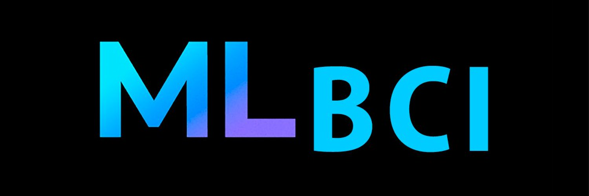
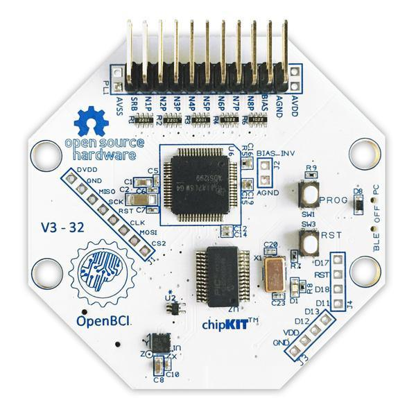

# MLH_BCI

Desarrollo de un electroencefalógrafo EEG, basado en **openBCI** para aplicaciones de **Machine Learning**.

# <a name="introduccion" style="text-decoration:none; color:black;">Introducción</a>

Este es un proyecto de **[MLHispano](https://bit.ly/2Oqingj)**, aquí encontrarás toda la información necesaria para construir tu EEG: esquemas, Gerber files, etc.

Este proyecto pretende ser un punto de partida donde cualquier individuo de la comunidad de pueda obtener un EEG y desarrollar su BCI a partir de sus propios módelos de machine learning.

A la izquierda el openbci y a la derecha el wifishield.

## Índice

- <a href="#ml-documentacion" >Esquemas, Gerber files, etc.</a>
- <a href="#ml-firmwares">Instalación de los firmwares sin RFduino</a>
- <a href="#ml-dfrobot">De RFduino a DFRobot</a>
- <a href="#ml-agradecimientos" >Agradecimientos</a>

## <a name="ml-documentacion" style="text-decoration:none; color:black;">Lista de materiales y documentación</a>

- [Descargar Interfaz gráfica](https://openbci.com/index.php/downloads)
- [Documentación general de OpenBCI](https://docs.openbci.com/Getting%20Started/00-Welcome)
- [Bootloader del pic32](https://github.com/ml-hispano/MLH_DiyBCI/tree/master/firmwares%20y%20bootloader/UDB32-MX2-DIP.bootloader.pic32.hex)
- [Firmware del pic32](https://github.com/ml-hispano/MLH_DiyBCI/tree/master/firmwares%20y%20bootloader/DefaultBoard.pic32.hex)
- [Firmware del esp-12E (wifishield)](https://github.com/ml-hispano/MLH_DiyBCI/tree/master/firmwares%20y%20bootloader/DefaultWifiShield.2.0.5.bin)
- [Proyecto del MLH_BCI v1 (by Javier Morales)](https://github.com/ml-hispano/MLH_DiyBCI/tree/master/proyecto%20en%20Eagle/projects.zip), puedes participar activamente desde [Drive](https://drive.google.com/drive/folders/1YpwGCYouReEstqHGXn4jKrlaMIpSWDeF?usp=sharing).

## <a name="ml-firmwares" style="text-decoration:none; color:black;">Instalación de los firmwares sin RFduino (con WifiShield)</a>

El circuito original utilizaba un módulo bluetooth (BLE) **RFduino**, que se encuentra **obsoleto**. Utilizaban un protocolo llamado [Gazell Nordic](https://0w0.pw/nRFGo_SDK/group__nordic__gzll.html), mucho más optimo que el utilizado por el bluetooth de la época. Hasta que llegó WifiShield aportando wifi al sistema.

**WiFiShield** permite omitir fácilmente los puertos serie llenos de latencia y las conexiones Bluetooth de bajo rango. Además, te permite transmitir más rápido y más lejos.

Un individuo con el alias "alwayswearshats" dijo haber logrado hacer funcionar el openbci con el wifishield sin necesidad de RFduino.
https://youtu.be/NXZVb7ENISs
[fuente](https://openbci.com/forum/index.php?p=/discussion/1773/is-cyton-programming-possible-without-using-bluetooth-dongle#latest)

#### Los pasos a seguir serían los siguientes:

- Es importante no acoplar los circuitos antes de programar sus firmwares.

- **Atención** antes de programar el firmware en el **pic32** tienes que subir el cargador de arranque (**bootloader**). El procedimiento para subir el bootloader en el pic32 es idéntico que para subir el firmware. Necesitarás de un PICkit3 para subir primero el bootloader y después el firmware, para ello puedes utilizar MPLAB IPE. Los pines a utilizar serán MCLR, VDD target (Ojo con este pin, deberás conectarlo a 3V3, no a DVDD), Ground, PGD y PGC. Todos los pines están incluidos en el circuito y todos son necesarios.

- Para programar el firmware en el circuito equivalente a wifishield necesitarás un adaptador FTDI para programar el firmware del **esp8266 ESP-12E**, para ello puedes utilizar esptool-gui, esptool, Arduino IDE, etc. Los pines a utilizar pueden variar, dependiendo de si estás utilizando un esp-12E o un kit development con este esp12E integrado, pero en definitiva VCC y GND no suelen ser necesarios. Al contrario de lo que sí sucede con el pin DTR de tu FTDI que quizás encuentres oculto en la parte trasera. Deberás conectar **DTR -> GPIO0** | **RTS -> RESET** | **TXD -> RXD** | **RXD -> TXD** para subir el firmware. [Fuente](https://github.com/espressif/esptool/wiki/ESP8266-Boot-Mode-Selection)

- Una vez terminado y habiendo conectado el dispositivo deberás conectarte a la red con nombre "OpenBCI-XXXX" y desde el navegador acceder a 192.168.4.1 allí podrás agregar la contraseña de la wifi de tu hogar. Entonces podrás ejecutar la aplicación openBCI-gui que debería detectar tu circuito. He mantenido el nombre "OpenBCI-XXXX" para poder utilizar el programa creado por ellos.

## <a name="ml-dfrobot" style="text-decoration:none; color:black;">De RFduino a DFRobot (TEL0120)</a>

Como hemos dicho, el RFduino está obsoleto, no lo vas a poder encontrar, así que he buscado una solucion alternativa si deseas utilizar el bluetooth. La solución viene de la mano de DFRobot, que vende un [módulo BLE 4.1](https://www.dfrobot.com/product-1647.html?search=tel0120&description=true) con el mismo procesador que utilizaba  RFduino, el ARM Cortex M0. Por lo que el firmware debería funcionar.

## <a name="ml-agradecimientos" style="text-decoration:none; color:black;">Agradecimientos</a>

- A [OpenBCI](https://openbci.com/)
- A todos los que forman parte de la comunidad MLHispano por su apoyo y en especial a DotCSV.
