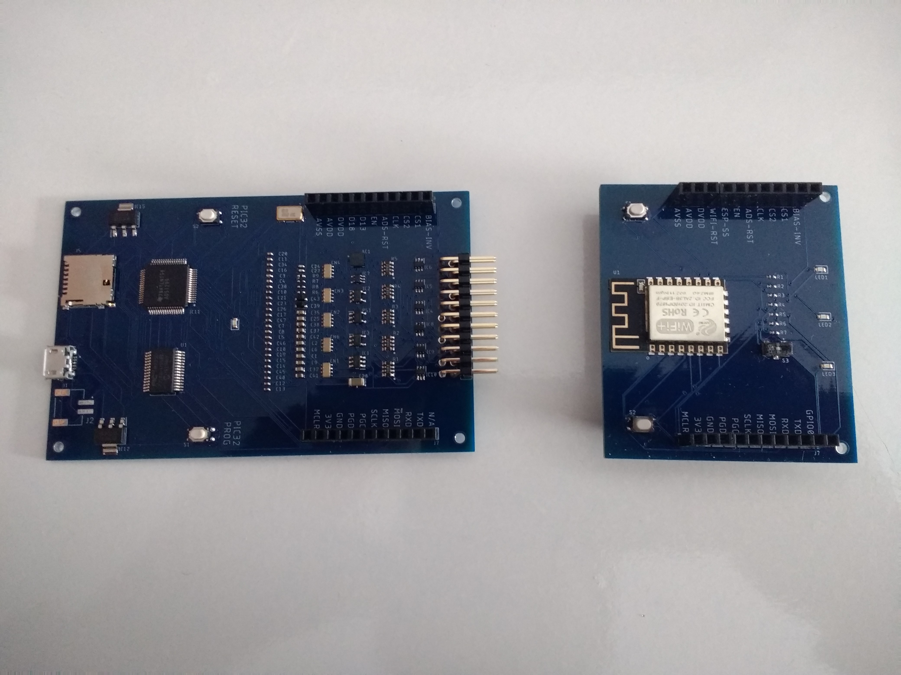
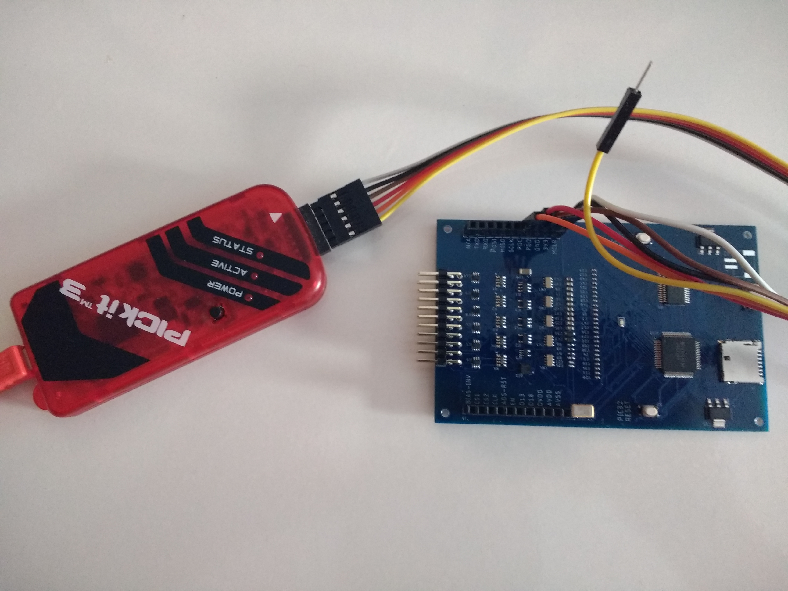
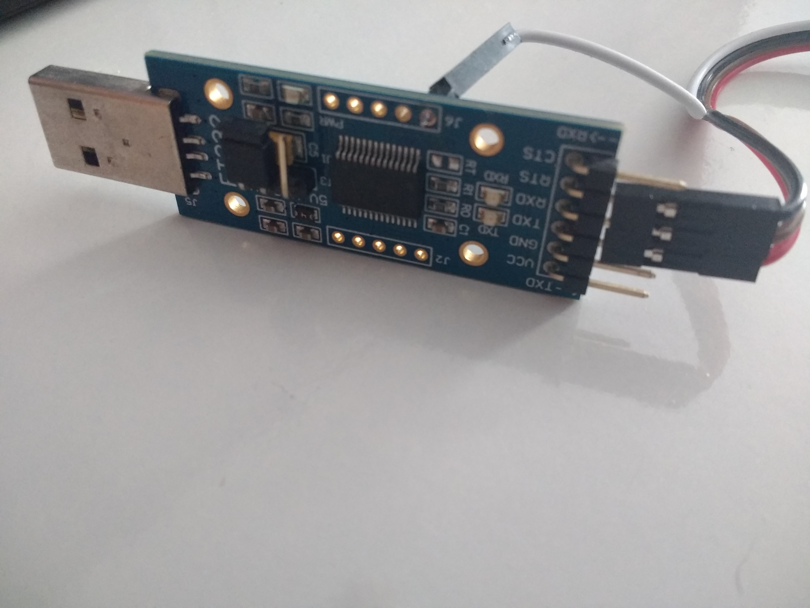
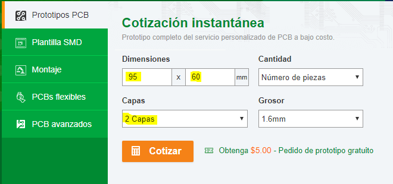
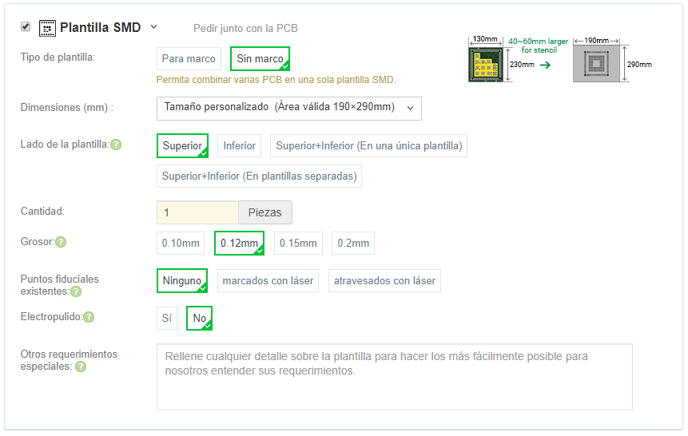
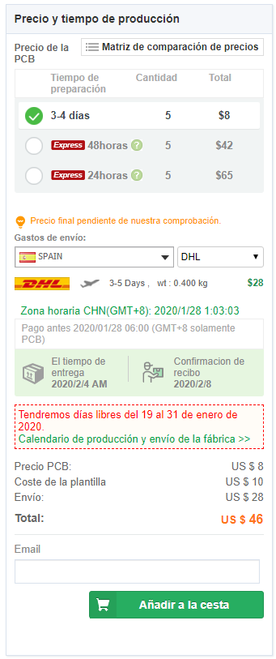

# MLH_BCI
> :warning: **¡ADVERTENCIA! PROYECTO OBSOLETO**
>
> Este proyecto se considera obsoleto. **Motivo principal:** El módulo Wi-Fi implementado provoca una alta **pérdida de paquetes** de información. Se recomienda migrar a la versión X.

Desarrollo de un electroencefalógrafo EEG, basado en **openBCI** para aplicaciones de **Machine Learning**.

# <a name="introduccion" style="text-decoration:none; color:black;">Introducción</a>

Este es un proyecto de **Javier Morales** para **[MLHispano](https://bit.ly/2Oqingj)**, aquí encontrarás toda la información necesaria para construir tu EEG: Esquemas en Eagle, Gerber files, etc.

*Este proyecto pretende ser un punto de partida donde cualquier individuo de la comunidad de pueda obtener un EEG y desarrollar su BCI a partir de sus propios módelos de machine learning.*

A la izquierda el BCI y a la derecha el Wifi.

A la izquierda el OpenBCI y a la derecha el WifiShield. (estos no son nuestros dispositivos)

## Índice

- <a href="#ml-documentacion" >Esquemas, Gerber files, etc.</a>
- <a href="#ml-firmwares">Instalación de los firmwares</a>
- <a href="#ml-handmade">Fabricando el circuito</a>
- <a href="#ml-uso">Uso y manejo del circuito</a>

<!-- - <a href="#ml-agradecimientos" >Agradecimientos</a> -->
<!-- - <a href="#ml-dfrobot">De RFduino a DFRobot</a> -->

## <a name="ml-documentacion" style="text-decoration:none; color:black;">Esquemas, Gerber files, bootloader, firmware, doc.</a>

- [Bootloader del pic32](https://github.com/ml-hispano/MLH_DiyBCI/tree/master/Firmwares%20&%20Bootloader/UDB32-MX2-DIP.hex)
- [Firmware del pic32](https://github.com/ml-hispano/MLH_DiyBCI/tree/master/Firmwares%20&%20Bootloader/DefaultBoard.ino.openbci.hex)
- [Firmware del esp-12E (wifishield)](https://github.com/ml-hispano/MLH_DiyBCI/tree/master/Firmwares%20&%20Bootloader/DefaultWifiShield.2.0.5.bin)
- [Proyecto del MLH_BCI en Eagle (por Javier Morales)](https://github.com/ml-hispano/MLH_DiyBCI/tree/master/Proyecto%20en%20Eagle/MLH_BCI.zip)
- [Gerber files de MLH_BCI (por Javier Morales)](https://github.com/ml-hispano/MLH_DiyBCI/tree/master/Gerber%20files/Gerbers_MLH_BCI.zip)
- [Descargar Interfaz gráfica](https://openbci.com/index.php/downloads)
- [Documentación general de OpenBCI](https://docs.openbci.com/Getting%20Started/00-Welcome)

## <a name="ml-firmwares" style="text-decoration:none; color:black;">Instalación de los firmwares</a>

Para esta instalación no necesitarás RFduino.

El circuito original utilizaba un módulo bluetooth (BLE) **RFduino**, que se encuentra **obsoleto**. Utilizaban un protocolo llamado [Gazell Nordic](https://0w0.pw/nRFGo_SDK/group__nordic__gzll.html), mucho más optimo que el utilizado por el bluetooth de la época. Hasta que llegó WifiShield aportando wifi al sistema.

**WiFiShield** permite omitir fácilmente los puertos serie llenos de latencia y las conexiones Bluetooth de bajo rango. Además, te permite transmitir más rápido y más lejos.

<!--
Un individuo con el alias "alwayswearshats" dijo haber logrado hacer funcionar el openbci con el wifishield sin necesidad de RFduino.
https://youtu.be/NXZVb7ENISs
[fuente](https://openbci.com/forum/index.php?p=/discussion/1773/is-cyton-programming-possible-without-using-bluetooth-dongle#latest)
-->

- Es importante **no acoplar los circuitos (el bci y la wifi) en el momento de programar sus firmwares** o quedarán inservibles.

#### bootloader en el PIC32:
- El procedimiento para subir el bootloader en el pic32 es distinto que para subir el firmware. Necesitarás de un PICkit3 para subir primero el bootloader, para ello puedes utilizar MPLAB IPE. Los pines a utilizar serán **MCLR**, **VDD target**, **Ground**, **PGD** y **PGC**. Todos los pines están incluidos en el circuito y todos son necesarios. El circuito tiene que tener la fuente de alimentación (MicroUSB) enchufado.

#### firmware en el PIC32:
- **Atención** antes de programar el firmware en el **pic32** tienes que subir el cargador de arranque (**bootloader**).
- Para cargar el firmware en el pic32 necesitarás de un adaptador FTDI, para ello puedes utilizar Arduino IDE, esptool o pic32prog. Los pines a utilizar serán **TXD a RXD** y **RXD a TXD**. El circuito tiene que tener la fuente de alimentación (MicroUSB) enchufado.

#### firmware en WifiShield:
- Para programar el firmware en el circuito equivalente a wifishield necesitarás un adaptador FTDI para programar el firmware del **esp8266 ESP-12E o ESP-12F**, para ello puedes utilizar esptool-gui, esptool, Arduino IDE, etc. Los pines a utilizar pueden variar, dependiendo de si estás utilizando un esp-12E o un kit development con este esp12E integrado, pero en definitiva VCC y GND suelen ser necesarios. Al igual que sucede con el pin DTR de tu FTDI que quizás encuentres oculto en la parte trasera.

- Deberás conectar **DTR a GPIO0**, **RTS a WIFI-RST**, **TXD a RXD** y **RXD a TXD** para subir el firmware. [Fuente](https://github.com/espressif/esptool/wiki/ESP8266-Boot-Mode-Selection)

- Una vez terminado y habiendo acoplado, ahora sí, los circuitos, deberás conectarte a la red con nombre "OpenBCI-XXXX" y desde el navegador acceder a la siguiente dirección: 192.168.4.1 allí podrás agregar la contraseña de la wifi de tu hogar, para que el dispositivo WifiShield se conecte a la wifi de tu hogar, en lugar de ser un punto de acceso. Entonces podrás ejecutar la aplicación [OpenBCI-GUI](https://openbci.com/index.php/downloads).

<!--
## <a name="ml-dfrobot" style="text-decoration:none; color:black;">De RFduino a DFRobot (TEL0120)</a>

Como hemos dicho, el RFduino está obsoleto, así que he buscado una solucion alternativa si deseas utilizar el bluetooth. La solución viene de la mano de DFRobot, que vende un [módulo BLE 4.1](https://www.dfrobot.com/product-1647.html?search=tel0120&description=true) con el mismo procesador que utilizaba  RFduino, el ARM Cortex M0. Por lo que el firmware debería funcionar.
-->

## <a name="ml-uso" style="text-decoration:none; color:black;">Uso y manejo del circuito</a>

**Sobretodo recordad utilizar como fuente de alimentación, o bien la conexión micro-USB o la batería, nunca ambos a la vez.**

Para empezar a utilizar tu dispositivo, lo primero que tienes que hacer es conectarte al punto de acceso creado por wifishield. Una vez hecho, deberás navegar a la siguiente url 192.168.4.1 y allí podrás introducir los datos de la wifi de tu hogar o trabajo para que wifishield se conecte a ella. Esto es lo único que tienes que hacer antes de poder empezar a disfrutar de tu EEG.

## <a name="ml-handmade" style="text-decoration:none; color:black;">¿Cómo fabrico el circuito?</a>

Esto es solo un ejemplo de lo que debes hacer para mandar a fabricar el circuito, en este caso con [pcbway.es](https://www.pcbway.es/setinvite.aspx?inviteid=292190)

- Dirígete a la página de pcbway, añade las dimensiones de la placa (95 x 60), selecciona 2 capas y pulsa "Cotizar".

- "Min pista/espacio" debe estar a 6/6 mil y "Min tamaño agujero" debe estar a 0.3 mm aunque el agujero de menor tamaño en el circuito es de 0.35 mm y corresponde a las vias.

- "Máscara de soldadura" se refiere al color de la placa y "Serigrafía" indica el color del texto.

- Cualquier opción en "Acabado superficial", por ejemplo, "Oro por inmersión (ENIG)" incrementará el precio de la placa y aumentará la calidad. No obstante, lo veo innecesario.

- Procesamiento de vias, será por defecto "tenting vias", es decir, vias cubiertas. Así ha sido configurado en el proyecto.

- También es interesante marcar la última opción, "No agregar número extra de producto de pcb a placa".

- Es necesario marcar la opción "Plantilla SMD", de este modo os llegará una plantilla de aluminio que podreis poner encima de la placa y pasar la pasta de soldadura por encima con una regla o similar. Podeis escoger el tipo de plantilla que mas os guste, "Con marco" o "Sin marco". Los puntos fiduciales se refieren a las vias, la opción "Ninguno" es correcta.

- Clicaremos en calcular, añadiremos el correo electrónico y ya podemos añadir a la cesta. Mas tarde, deberemos añadir el Gerber y el archivo el BOM con los componentes del proyecto. Entonces estará listo para revisión y una vez esta acabe podremos comprarla.

## <a name="ml-agradecimientos" style="text-decoration:none; color:black;">Agradecimientos</a>

- A [OpenBCI](https://openbci.com/)
- A todos los que forman parte de la comunidad MLHispano por su apoyo y en especial a DotCSV.
